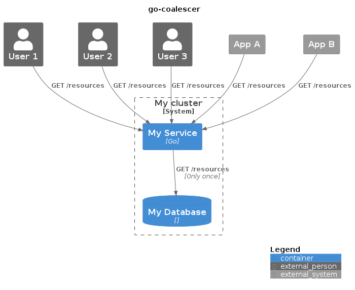

# go-coalescer

This package allows "merging" multiple similar operations so the work is done only once for all the requests.

As described in the diagram below, your code might receive multiple similar requests in a short time. The package go-coalescer allows your code to execute the operation once for all those requests.



Usage example:

```golang
package main

import (
	"log"
	"time"

	"github.com/cassioconti/go-coalescer/pkg/coalescence"
)

func main() {
	myCoalescer := coalescence.NewCoalescer()

	// cacheKey is an identifier for the operation in case
	// you want to use the same Coalescer instance for multiple
	// operations or combination of parameters.
	cacheKey := "cacheKey"

	// cacheExpire is the duration after which the operation
	// should be executed again if new requests arrive.
	cacheExpire := 5 * time.Millisecond

    // This could be within a HTTP handler, or a message queue
    // handler, or your library operation handler.
	result, err := myCoalescer.Do(func() (interface{}, error) {
		// Some expensive operation. This could be a DB access,
		// HTTP request, simulation job, wherever...
		time.Sleep(2 * time.Millisecond)
		return "response", nil
	}, cacheKey, cacheExpire)

	// From here forward, business as usual...
	if err != nil {
		log.Fatal(err)
	}

	log.Println(result)
}
```

More examples can be found in `pkg/coalescence/coalescer_test.go`
